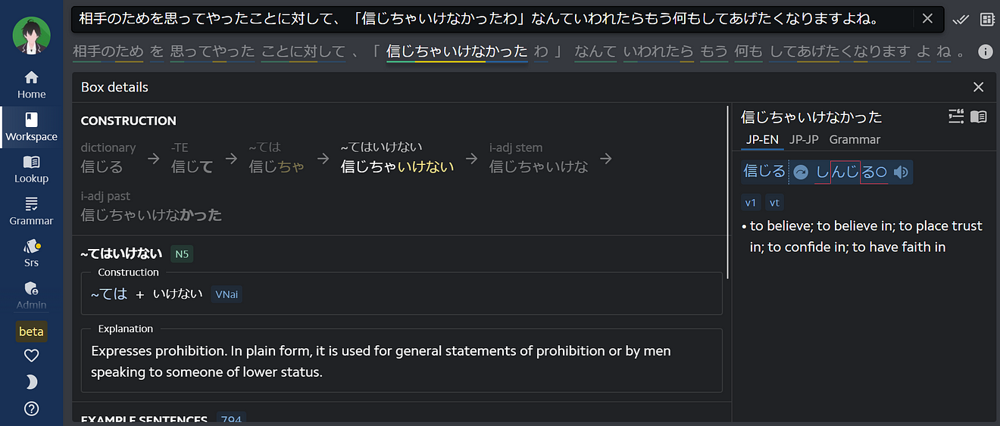
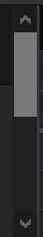
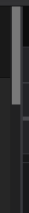
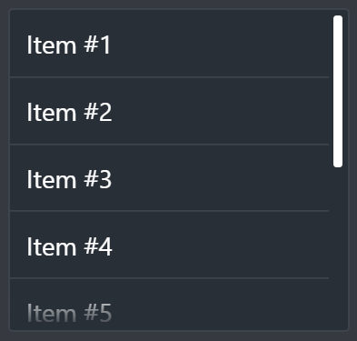
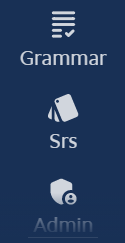

# Creating the Perfect Custom Scrollbar

2021-06-02 · #web #css

---

From https://lapisapp.com which uses mr-scroll

In a world that's moving more towards sleek looking single page apps, the native browser scrollbar has been the mainstay of the old legacy look and feel. And while there has always been a way to customize it on certain browsers, the lack of a standard specification for the longest time left a lot to be desired.

And even now, the new standard defined by W3C isn't anywhere near satisfactory, as there's no feature parity with the old left behind spec that is still limited to webkit based browsers.

In this article, I'm going to briefly discuss the problems with both the web standard and the already existing custom scrollbars, and eventually how I ended up developing mr-scroll, a library that solves all of these problems and adds useful features on top. It also has ready to consume packages for popular frameworks (angular, react, vue). If you're not interested about the history and problems feel free to go straight to that part.

## The web standard problem

Once upon a time, IE introduced a way to customize the scrollbar. This carried over to a now-stale specification that allows customizing almost everything about the scrollbar, from its width to the track, thumb, button, etc. This is known as the webkit scrollbar customization and it's only available in webkit based browsers (`::-webkit-scrollbar-*`). One major browser that doesn't support this is Firefox, it doesn't work there and it never will.

A few years ago, the W3C started drafting a new standard that replaces the older spec, promising this time to finally have a standard for customizing scrollbars. This is the CSS Scrollbars Module. Alas, this new standard feels extremely barebone, contributing only 2 CSS properties: scrollbar-width and scrollbar-color. This is nowhere near the level of customization we have with webkit customization, as the only 2 features you can control is the colors of the track/thumb, and whether you want a normal or "thin" scrollbar.

scrollbar-width: auto;

scrollbar-width: thin;

And that is pretty much all the customization you get.

In particular, this means you won't be able to change track/thumb sizes, spacing, border-radius, etc, if you want to maintain the same visual look across browsers. If you're okay with that, then it's perfectly fine to just go with this. It's a standard that will be here for a long time.

But if you want a more full featured solution to the scrollbar problem, then read on.

## The custom scrollbar libraries problem

To counter the web standard problem, there has been no shortage of custom scrollbar libraries. That said, there's a reason people shrink at the thought of having to use one and decide to go with the native scrollbar, even when it doesn't suit the modern look of their app. They aren't perfect, they don't always behave as the native scrollbar, they sometimes miss valuable features (like horizontal support), and they regularly go visually out of sync.

The first drawback is when you try to emulate the scrolling using JavaScript, instead of somehow taking advantage of the native scrollbar behind the scenes. Libraries going this route will be messing with what the user's used to (no middle mouse click drag, different feel to the scrolling), so this is a complete no-go for me.

For the sync problem, most custom libraries usually use a brute-force approach to solving this. That is to subscribe to as many events as possible so as to cover most cases of the scrollbar updating. On top of it being inefficient, it's also impossible to cover all cases this way. There's a fairly new way to solve this problem, and that is using what's called a markup observer. These are mutation/resize observers and they're now supported by all modern browsers. This is the method mr-scroll uses.

## mr-scroll

The simplest mr-scroll in action

[mr-scroll](https://github.com/mrahhal/mr-scroll) is an open sourced library I spent a long time perfecting while using it in several projects. It succeeds in solving all the problems listed above, providing a single standard way to use customizable scrollbars that feel native and look the same across all modern browsers. And to make it easier for the consumer, it has idiomatic and efficient wrapper packages for popular frameworks (angular, react, vue).

In addition, it also provides a few additional features that build on top of the scrollbar.

### Different modes

- Auto: This is what you're used to when you use the native browser scrollbar.
- Overlay: A thinner scrollbar that behaves as an overlay on top of the scroll content, instead of having the track take space.
- Hidden: This is great when you want the scroll when there's an overflow, but you don't actually want to display a scrollbar at all (small sidebars for example).

There are also flags such as the ability to show on hover only.

### Content fade

You can see the content fade in action at the bottom, indicating that there's more content that's hidden below "Admin"

### Documented support for creating complex layouts

When you have complex full page layouts, it's usually tricky dealing with overflowing content. mr-scroll also attempts to fully support this use case and documents how to do this, providing support in the form of SCSS mixins that help when developing such layouts.

### css-theming support

It also has a support package for [css-theming](https://github.com/mrahhal/css-theming).

---

For more, check [mr-scroll on GitHub](https://github.com/mrahhal/mr-scroll).
