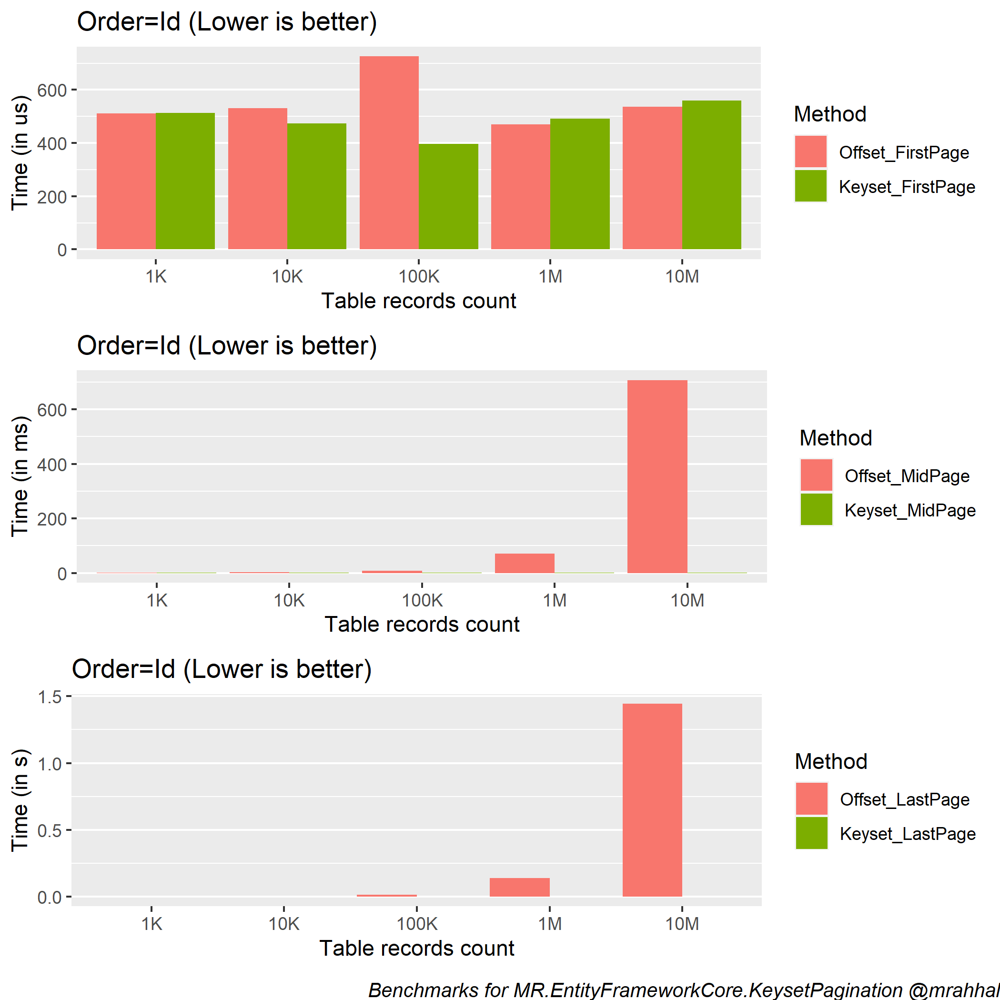
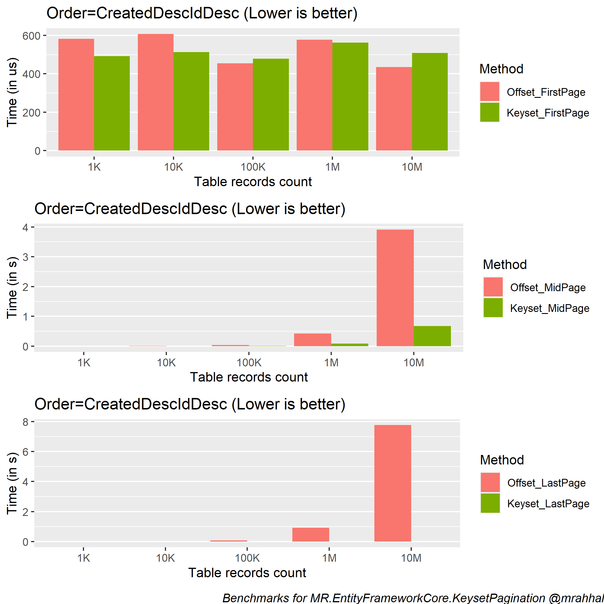
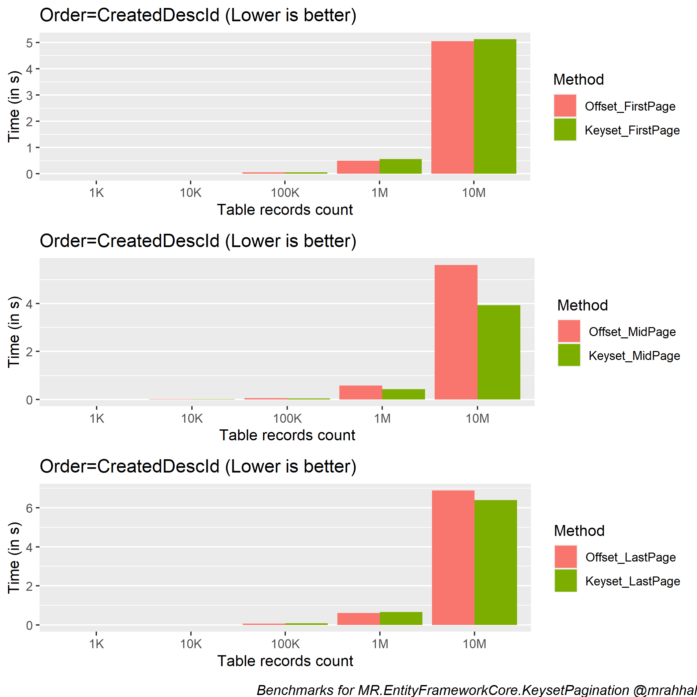

# Offset vs Keyset Pagination

2023-05-14 · #pagination #benchmark

---

Offset pagination is the most used pagination method, often for no other reason than it being the easiest most available choice. But in a lot of cases, keyset pagination can provide a much more performant pagination mechanism.

I'm going to go over a few benchmarks between offset and keyset pagination. These are taken from [MR.EntityFrameworkCore.KeysetPagination](https://github.com/mrahhal/MR.EntityFrameworkCore.KeysetPagination), a library which greatly simplifies doing keyset pagination when using [EF Core](https://learn.microsoft.com/en-us/ef/core/).

First, we'll briefly introduce each pagination method, the problems, and the use cases best suited for each of them, without going into too much details.

I'm particularly interested in the common use cases where offset pagination becomes a bottleneck, and to see just how much of a difference keyset pagination will make in comparison.

If you're already familiar with both methods, you can skip directly to the [benchmarks section](#benchmarks) for a TL;DR and then a conclusion.

## Offset pagination

Offset pagination is the classic way of paginating data, both in EF Core and in pretty much any other framework/ORM/language. The reason is simple. It's both the easiest way to do pagination _and_ it's intuitively easy to understand.

Offset pagination works by using the `OFFSET` SQL clause combined with a pipelined top-N clause (aka `FETCH FIRST`). This provides an intuitive pagination method where you can imagine pages of data each covering records from a well known offset to another.

The main advantage of offset pagination is allowing random access to any numbered page. This usually appears as the following from a user perspective, where a user can _seek_\* to any page.

\* In database terms this isn't really _seeking_, it's kind of _scanning_ the table to reach the start of the target page. And so we arrive at the big problem with offset pagination.

The further away the page you want to retrieve is, the worse performance gets, and the longer the query takes. The reason for this is that the database engine will still need to go through all the pages you're _skipping_ until it reaches the target page. So it's closer to a table scan, at least up until the desired page is reached.

One additional disadvantage to offset pagination is what we call _unstable pagination_. This describes a bunch of possible anomalies when paginating, including skipping over data or showing duplicated data. As a common example, imagine records getting added/deleted in the page you're in (or the pages before), and then navigating to the next page. This leads to any number of unexpected skipped/duplicated data. This problem can't be solved, not by you nor the database, as it's purely a side effect of how offset pagination inherently works by design.

## Keyset pagination

Keyset pagination, also called seek pagination or cursor pagination, is a less known method of pagination. The reason is also simple. It's hard to implement, and it keeps getting more complicated the more columns you include in the order/keyset. It's also riddled with caveats that you wouldn't face in offset pagination.

Even with all these problematic aspects, keyset pagination is still extremely important as it's a much more performant way of paginating data. It's particularly well suited to scenarios where you don't need random access to numbered pages.

Keyset pagination works by starting from a reference record, seeking there, and then either accessing records before or after the reference. This is accomplished through a specific combination of `ORDER BY` and `WHERE` clauses.

Here are a few common use cases that would benefit the most out of keyset pagination:

- Infinite scrolling (ex. social network feeds such as twitter)
- An ever growing list of records that you want to be able to fully access (ex. GitHub commits)

On the other hand, and in contrast to offset pagination, keyset pagination proves more difficult to implement and to generally work with. It's also less intuitive to understand. In addition, the particular predicate inside `WHERE` also changes for the same logical query depending on whether you're doing an after or before seek, leading to more complexity. That said, a well made library can greatly shrink that difficulty difference between offset and keyset to practically zero.

What about the unstable pagination problem that afflicted offset pagination? In keyset pagination, if your keyset consists of immutable columns (columns that don't change, ex. `Created` + `Id`), then stable pagination is guaranteed. You'll never skip over or see duplicated data as you navigate pages. Depending on your requirements, this could be yet another major advantage.

From a user perspective, here is an example of how a user will interact with a keyset paginated page:

This second example is from GitHub's commits page:

An interesting functionality you could implement is a page where a user searches and selects a record, and then a list is retrieved containing a few records before and a few records after the selection. This isn't possible with offset pagination. Think of a git client where a user can search for a commit, and then _expand_ the context, so as to see further and further above and below. Incidentally, this is very similar to how some git clients expand hunks in diffs.

## Benchmarks

We'll benchmark the following methods under a few different examples:

- FirstPage: Query the first page
- MidPage: Query the middle page (i.e for N=1K this benchmark queries the data starting from the 500'th record)
- LastPage: Query the last page

In addition, we'll run this for different numbers of record count in the table (from 1K to 10M) to see how the pagination methods fair as the record count exponentially increases.

To start, let's take the simplest example. We'll paginate data according to the `Id` column.

Notice that when querying the first page, offset pagination does just as well as keyset. Offset pagination starts falling behind remarkably the further away the page you want to read is.

To that point, the keyset bars (green) are barely visible in the MidPage and LastPage graphs. This shows the major difference in performance characteristics over large amounts of data when querying further away pages.

Here's the same benchmark but now for the following order: `Created` + `Id`

This is a very common order to have in many places. The reason we have an `Id` in addition to `Created` is to make sure this keyset is [deterministic](https://github.com/mrahhal/MR.EntityFrameworkCore.KeysetPagination#deterministic-keysets).

Also note that both are descending because we happen to have an index that's ASC on both, so keep in mind that the index should be compatible with your keyset's order.

Here's what would happen without a proper index:

Keyset pagination becomes almost as bad as offset, because just like in the offset case, the database engine will need to do a table scan instead of a seek as there's no proper index to seek with. Even getting the first page is problematic.

## Conclusion

_Which method should I choose?_

Putting the main differences into a table.

|                        | Offset                                                             | Keyset                                  |
| ---------------------- | ------------------------------------------------------------------ | --------------------------------------- |
| Performance            | worse over large data\*                                            | stable over large data\*                |
| Duplicate/Skipped data | always a possibility if data gets updated between page navigations | no duplication/skipping\*\*             |
| Pages                  | can access random pages                                            | can only go to first/previous/next/last |

\* "over large data" here means trying to access _further away_ pages. 
\*\* Only if you use a [deterministic keyset](https://github.com/mrahhal/MR.EntityFrameworkCore.KeysetPagination#deterministic-keysets).

If you have a requirement that forces you to allow random access to numbered pages, then you really don't have a choice but going with offset pagination. Otherwise, if you don't have a lot of data or if you can put an upper limit on the number of pages you want your users to navigate to (for example 100 pages), and you are not bothered by unstable pagination, then you could use offset pagination.

For every other case, prefer keyset pagination. It's better, it's faster.

Libraries such as [MR.EntityFrameworkCore.KeysetPagination](https://github.com/mrahhal/MR.EntityFrameworkCore.KeysetPagination) make it a breeze to implement. For other languages, check the "But the Frameworks…" section in [this page](https://use-the-index-luke.com/no-offset) for keyset support in other frameworks.

## Links

- https://github.com/mrahhal/MR.EntityFrameworkCore.KeysetPagination
- https://github.com/mrahhal/MR.AspNetCore.Pagination
- https://use-the-index-luke.com/no-offset
